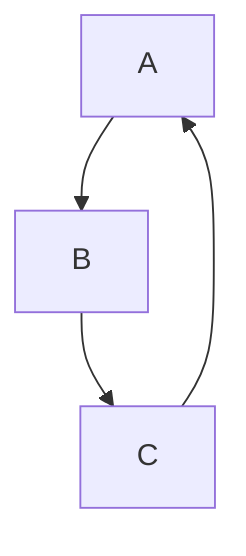

# Markdown Renderer Test Suite

## 1. Headings

# H1 Heading

## H2 Heading

### H3 Heading

#### H4 Heading

##### H5 Heading

###### H6 Heading

---

## 2. Emphasis & Text Styling

**Bold Text**
*Italic Text*
***Bold + Italic***
~~Strikethrough~~
`Inline code`

> Blockquote
>
> > Nested blockquote

---

## 3. Lists

### Unordered List

* Item 1
* Item 2

  * Nested Item

    * Deep Nested Item

### Ordered List

1. First
2. Second

   1. Sub-item
   2. Sub-item

### Task List

* [x] Completed task
* [ ] Incomplete task

---

## 4. Links & Images

[Google](https://www.google.com)


---

## 5. Code Blocks

### Inline Code

Use `printf("Hello World");`

### Fenced Code Block (C++)

```cpp
#include <iostream>
using namespace std;

int main() {
    cout << "Hello, World!" << endl;
    return 0;
}
```

### Fenced Code Block (Python)

```python
def fib(n):
    return n if n <= 1 else fib(n-1) + fib(n-2)
```

---

## 6. Tables

| Name  | Age | Role      |
| ----- | --- | --------- |
| Alice | 25  | Engineer  |
| Bob   | 30  | Scientist |
| Carol | 22  | Designer  |

---

## 7. Horizontal Rule

---

## 8. Escaping Characters

*Not italic*
# Not a heading
`Not code`

---

## 9. HTML Support

<div style="color: red;">
This is raw HTML inside Markdown.
</div>

<span style="font-weight:bold;">Inline HTML</span>

---

## 10. Footnotes

Here is a sentence with a footnote.[^1]

[^1]: This is the footnote content.

---

## 11. LaTeX / Math

### Inline Math

Euler's identity: $ e^{i\pi} + 1 = 0 $

### Display Math

$$
\int_{-\infty}^{\infty} e^{-x^2} dx = \sqrt{\pi}
$$

### Matrix

$$
\begin{bmatrix}
1 & 2 \\
3 & 4
\end{bmatrix}
$$

### Align Environment

$$
\begin{aligned}
a &= b + c \\
d &= e - f
\end{aligned}
$$

---

## 12. Blockquotes with Code

> Example:
>
> ```javascript
> console.log("Inside blockquote");
> ```

---

## 13. Nested Elements

1. Item with code:

   ```js
   let x = 10;
   ```
2. Item with list:

   * Sub-item
   * Sub-item

---

## 14. Definition List (Non-standard)

Term 1
: Definition 1

Term 2
: Definition 2

---

## 15. Emoji

😀 😎 🚀 🔥

---

## 16. Special Cases

### Mixed Formatting

**Bold *italic `code`* text**

### Long Paragraph Wrapping

Lorem ipsum dolor sit amet, consectetur adipiscing elit. Sed do eiusmod tempor incididunt ut labore et dolore magna aliqua.

---

## 17. Edge Cases

* Empty list item:
*
* Multiple spaces
* Line break test

Line 1
Line 2

---

## 18. Autolinks

https://example.com

---

## 19. Inline HTML with Markdown

<b>Bold HTML</b> and *Markdown Italic*

---

## 20. Syntax Stress Test

***~~`All combined formatting`~~***

---

## 21. YAML Front Matter (if supported)

```yaml
---
title: Markdown Test
author: Test User
date: 2026-01-01
---
```

---

## 22. Comments

<!-- This is a comment and should not be rendered -->

---

## 23. Collapsible Section (HTML)

<details>
<summary>Click to expand</summary>

Hidden content here.

</details>

---

## 24. Diagram Placeholder (Mermaid if supported)



---

## 25. End of Test

If all sections render correctly, your Markdown engine is robust.

## 26. Citation

This is a citation to Einstein's 1905 paper[@einstein1905].